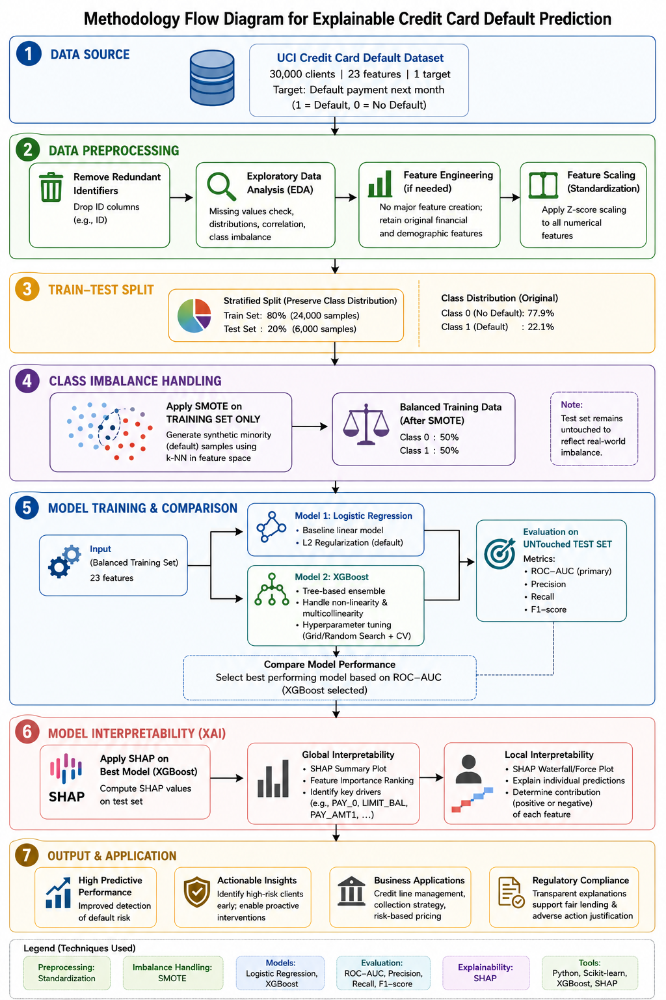

# Credit-Card-Default-Prediction
Credit Card Default Prediction using XGBoost and Explainable AI (SHAP)

## 📌 Project Overview
The accurate prediction of credit card defaults is a critical imperative for modern financial institutions seeking to mitigate risk and optimize capital allocation. While complex machine learning algorithms offer superior predictive capabilities over traditional statistical methods, their "black-box" nature often precludes them from deployment in highly regulated financial environments. 

This project addresses the dual challenges of predictive efficacy and model interpretability by analyzing the UCI Credit Card Default dataset. We evaluate the performance of an advanced ensemble method (XGBoost) against a traditional baseline (Logistic Regression) and utilize SHapley Additive exPlanations (SHAP) to ensure algorithmic transparency and extract localized decision boundaries.

## 👥 Research Team
* **Annet Maria Cyriac** -  Predictive Modeling, Explainability & Repository Management
* **Vinod Vincent** -  Data Preprocessing & SMOTE Implementation
* **Amarnath A** - Exploratory Data Analysis & Visualizations
* **Bency Cleetus** - Practical Implications & Future Work
* **Ajay Haridas** - Literature Review & Foundational Frameworks

## 📊 Dataset
The empirical analysis was conducted using the widely benchmarked "Default of Credit Card Clients" dataset, originally sourced from the UCI Machine Learning Repository. 
* **Instances:** 30,000 client profiles
* **Features:** 23 explanatory variables (demographics, historical repayment status, billing statements, and previous payment amounts)
* **Target:** Binary classification (1 = Default, 0 = No Default)

## 🛠️ Methodology & Tech Stack

* **Exploratory Data Analysis (EDA):** Feature distribution profiling, correlation heatmaps, and engineered metrics (e.g., Credit Utilization Ratio).
* **Data Preprocessing:** Standard scaling and application of the **Synthetic Minority Over-sampling Technique (SMOTE)** to combat severe class imbalance in the financial data.
* **Modeling:** **XGBoost Classifier** (optimized via hyperparameter tuning) compared against a Logistic Regression baseline.
* **Explainability (XAI):** **SHAP (SHapley Additive exPlanations)** framework to interpret global feature interactions and localized decision boundaries.
* **Libraries:** `pandas`, `numpy`, `matplotlib`, `seaborn`, `scikit-learn`, `xgboost`, `imblearn`, `shap`.

## 💡 Key Findings
1. **Predictive Superiority:** The XGBoost ensemble model significantly outperformed the traditional baseline, achieving an Area Under the Receiver Operating Characteristic Curve (ROC-AUC) of 0.7712 compared to 0.6908.
2. **Behavioral Drivers:** SHAP analysis revealed that recent repayment delays (`PAY_0`) serve as the primary catalyst for default predictions. Empirical data show that default rates spike from ~15% to nearly 70% once a client reaches the two-month delinquency threshold.
3. **Institutional Trust:** Higher extended credit limits (`LIMIT_BAL`) act as robust protective indicators, correlating heavily with a lower propensity to default.
## 📈 Practical Implications & Future Work

**Practical Implications (Business Applications):**
* **Proactive Risk Mitigation:** Utilizing XGBoost and SHAP's sensitivity to payment delays to create an "Early Warning System." This allows institutions to trigger pre-emptive interventions, such as personalized payment plans, before severe delinquency occurs.
* **Dynamic Credit Line Management:** Using the insights from `LIMIT_BAL` to simulate default probabilities under varying credit limits, enabling banks to dynamically adjust credit lines to maximize profitability while bounding risk exposure.
* **Regulatory Compliance & Fair Lending:** Leveraging SHAP to solve the "black-box" problem. This framework can generate legally compliant "Adverse Action Notices" that cite the exact behavioral metrics that led to a credit denial, thereby proving that decisions are based on objective financial data.

**Future Work:**
* **Concept Drift Analysis:** Applying the XGBoost-SHAP pipeline to longitudinal datasets to evaluate the temporal stability of SHAP values across macroeconomic shifts (e.g., inflation or changing interest rates).
* **Alternative Data Integration:** Exploring the integration of unstructured data, such as NLP applied to customer service interactions or geospatial transaction data, to further enhance the AUC.
* **Deep Learning Benchmarking:** Comparing the predictive efficacy and computational overhead of advanced deep learning architectures tailored for tabular data (like TabNet) against tree-based ensembles.
## 🚀 How to Run the Code
All computational models and exploratory data analyses were executed in Python via Google Colab.

1. Open the interactive notebook: 
2. Run the first cell to install necessary dependencies (`shap`, `xgboost`, `imbalanced-learn`).
3. The dataset is configured to download automatically via `gdown` into the temporary Colab environment in the second cell. No manual data downloading or Drive mounting is required.
4. Execute the cells sequentially to reproduce the EDA visualizations, SMOTE balancing, XGBoost training, and SHAP summary plots.

## 📄 License
This project is licensed under the MIT License - see the [LICENSE](LICENSE) file for details.
